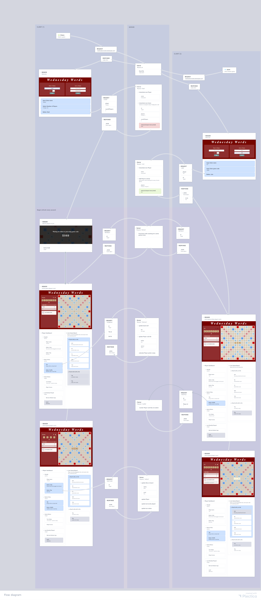

Wednesday Words
===================================
Remote multiplayer web game

## Start a game
1. Using Google Chrome on a desktop, go to [wednesday-words.herokuapp.com](https://wednesday-words.herokuapp.com/).
2. Start a game with your name and select the total number of players (2 minimum).
3. Share the unique 4-digit game code generated for your game and wait for others to join. Your game will start when all players have joined :-)

## Features
- 2 to 4 remote players
- Player dashboard with drag-and-drop tiles, scoreboard, turn status, points-in-play (dynamically calculated with each tile move), and definitions of last word played using Merriam Webster's API
- Live board displays real-time updates to all players

## Development

- Node.js http server
- JavaScript client
- ES6 Class-based game model
- Merriam Webster's API word definition lookup
- Heroku host

### Client-Server Flow

### To do

#### refactor
- [ ] React-based UI (in progress)

#### features
- [ ] user action: shuffle rack tiles
- [ ] user action: save/pause game
- [ ] user action: rejoin in-progress game
- [ ] sound effects
- [ ] user action: exchange tiles
- [ ] chat widget in player dashboard
- [ ] demo game for 1 player

#### tests
- [ ] UI component tests
- [ ] server/build test
- [ ] browser testing
 
#### bugs

- [ ] Fix: look and feel of drag and drop in Safari
